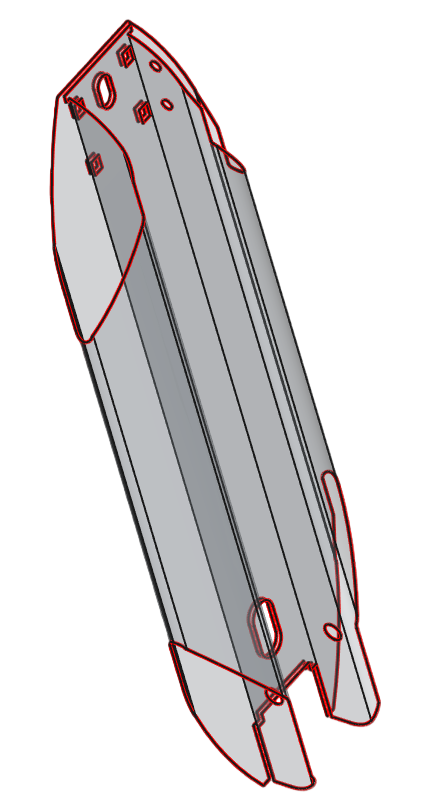
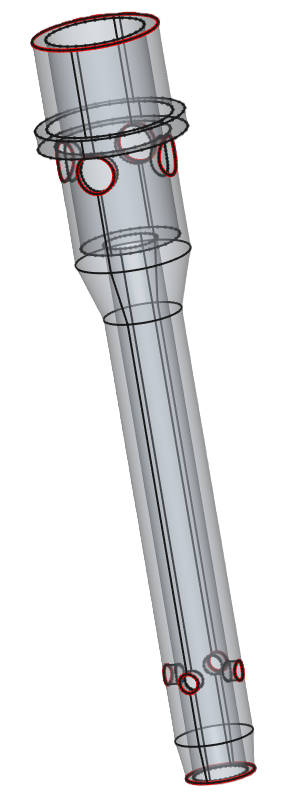
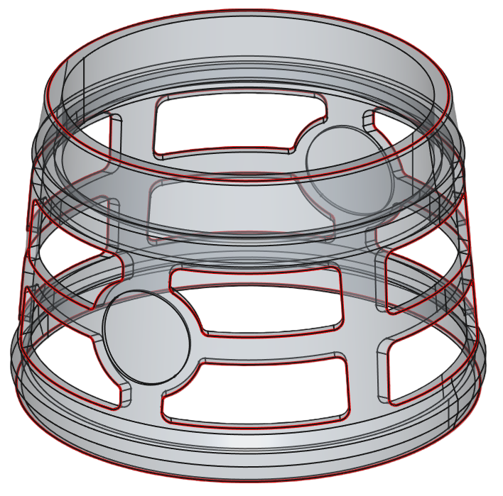

# 加工路径识别 / CuttingRails 调用示例（C++ / OCCT）

本仓库提供一段 **加工路径识别（切割轨迹识别）** 的调用示例代码，演示如何对输入 CAD/几何数据进行：

## 调用示例代码（完整 main）
```cpp
int main() {
    std::vector<std::string> files;
    files.clear();
    files.push_back("2.STEP");
    files.push_back("626.IGS");
    files.push_back("660.stp");

    for (size_t i = 0; i < files.size(); i++)
    {
        TopoDS_Shape result;
        try {
            result = ReadShape(files[i].c_str());
            if (result.IsNull()) {
                continue;
            }
        }
        catch (const std::exception& e) {
            // handles all exceptions derived from std::exception
            std::cout << "OCCT Standard exception: " << e.what() << std::endl;
        }
        catch (...) {
            // handles any other exception
            std::cout << "OCCT Unknown exception caught" << std::endl;
        }
        try {
            auto fileName = GetFileNameFromPath(files[i].c_str());
            TopoDS_Shape shape = result;

            double tol = 0.1;
            gp_Vec vec;
            TopoDS_Shape outerBoundFaces;
            TopoDS_Shape innerBoundFaces;
            TopoDS_Compound rails;
            TopoDS_Compound railsFaces;
            TopoDS_Compound twinRails;
            TopoDS_Compound twinRailsFaces;
            TopoDS_Compound unmatchedEdges;

            // 查找孤立边
            TopoDS_Compound isolatedEdges;
            CuttingRails::GetIsolatedEdges(shape, isolatedEdges);

            //拉伸方向API
            bool suc = CuttingRails::GetExtrudeDirection(shape, vec);

            // 计算加工路径
            CuttingRailsOption option;
            //option.singleBorderType = SingleBorderType::Outer;
            CuttingRails::GetCuttingRails(shape, outerBoundFaces, innerBoundFaces, rails, railsFaces,
                twinRails, twinRailsFaces, unmatchedEdges, option, tol);
        }
        catch (const std::exception& e) {
            // handles all exceptions derived from std::exception
            std::cout << "CC Standard exception: " << e.what() << std::endl;
        }
        catch (...) {
            // handles any other exception
            std::cout << "CC Unknown exception caught" << std::endl;
        }
    }
    return 0;
}
```

## 效果预览

### 识别结果示例
<p align="center">
  
  
  
</p>

## 依赖环境

- C++11
- OCCT（OpenCASCADE >= 7.2.0）
- 工程内提供的 CuttingRails 模块/库（包含 `CuttingRails::GetCuttingRails` 等接口）

---

## 备注

- tol = 0.1 会影响识别稳定性，建议按模型类型调参
